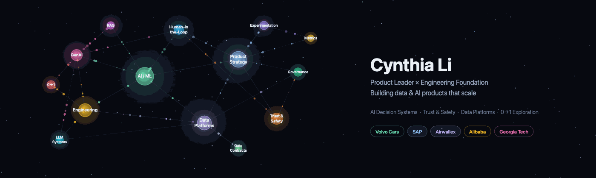
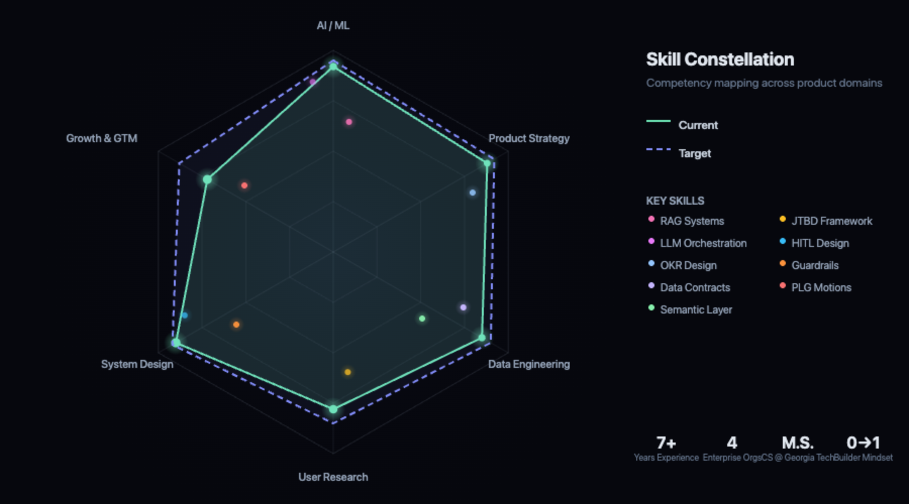

 

---

I build AI products in high-stakes, policy-constrained environments, combining LLM-powered workflows with human-in-the-loop governance and measurable quality signals. My background spans software engineering, product management, and applied AI across Volvo Cars, SAP, Airwallex, and Alibaba.

I care about translating complex systems into intuitive experiences. I work close to the code while thinking in systems, metrics, and long-term leverage.

I belive great products sit at the intersection of:

* Technical depth
* Clear strategy
* User empathy
* Strong execution

## Featured Work

<table>
<tr>
<td width="50%">

### [Escalation by Design](https://cynthialmy.github.io/2026-01-27-policy-aware-factuality-assessment)
Multi-agent fact-checking with confidence gating and human routing to reduce false positives in content moderation at scale.

`Trust & Safety` `LLM Systems` `HITL`

</td>
<td width="50%">

### [Procurement AI: Discovery & ROI](https://cynthialmy.github.io/2025-02-02-procurement-ai)
Shadowing buyers to quantify cognitive load, then building RAG that cut search time 25%.

`AI / ML` `User Research` `RAG`

</td>
</tr>
<tr>
<td width="50%">

### [Four-Layer Harm Mitigation](https://cynthialmy.github.io/2025-01-17-ai-solution)
How model selection, grounding, and UX constraints combine to build trustworthy enterprise AI systems.

`Enterprise AI` `Guardrails` `Governance`

</td>
<td width="50%">

### [Self-Evolving IDE Workflows](https://cynthialmy.github.io/2026-02-27-self-evolving-ai-assistant/)
Designing a lightweight, file-based AI system with structured memory and evolution.

`Context Engineering` `Agentic RAG` `0→1`

</td>
</tr>
</table>

<a href="https://cynthialmy.github.io"><b>View all case studies →</b></a>

## Toolbox

## GitHub Activity

&nbsp;&nbsp;

## Academic Foundation

**M.S. in Computer Science, Georgia Institute of Technology**

Coursework in AI, machine learning, data analysis, visualization, and human-computer interaction.

Selected courses

| AI & ML | Data & Analytics | Design & Strategy |
|---------|-----------------|-------------------|
| Robotics: AI Techniques | Data and Visual Analytics | Human Computer Interaction |
| Machine Learning for Trading | Computational Data Analysis | Intro to Cognitive Science |
| ML and Data Science Tooling | Information Visualization | Software Development Process |
| Matrix Methods in Data Analysis | Intro Analytics Modeling | Strategic Management |

Skill Constellation

 

 

## Connect

---

The best systems are the most intentional.

